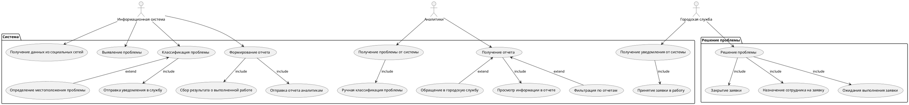

# Диаграмма "Процесса обработки и реагирования на проблемы".

```plantuml
@startuml
actor "Информационная система" as is
actor "Аналитики" as an
actor "Городская служба" as gs
package "Система"{
usecase "Получение данных из социальных сетей" as UC1
usecase "Выявление проблемы" as UC2
usecase "Классификация проблемы" as UC3
usecase "Формирование отчета" as UC4
usecase "Определение местоположения проблемы" as UC9
usecase "Отправка уведомления в службу" as UC10
usecase "Сбор результата о выполненной работе" as UC11
usecase "Отправка отчета аналитикам" as UC12
usecase "Получение проблемы от системы" as UC5
usecase "Получение отчета" as UC6
usecase "Ручная классификация проблемы" as UC13
usecase "Просмотр информации в отчете" as UC15
usecase "Фильтрация по отчетам" as UC16
usecase "Обращение в городскую службу" as UC17
usecase "Получение уведомления от системы" as UC7
usecase "Принятие заявки в работу" as UC20
}

package "Решение проблемы"{
usecase "Закрытие заявки" as UC19
usecase "Решение проблемы" as UC8
usecase "Назначение сотрудника на заявку" as UC14
usecase "Ожидания выполнения заявки" as UC18

}


is --> UC1
is --> UC2
is --> UC3
is --> UC4

an --> UC5
an --> UC6

gs --> UC7
gs --> UC8

UC3 <-- UC9 : extend
UC3 --> UC10 : include
UC4 --> UC11 : include
UC4 --> UC12 : include
UC5 --> UC13 : include
UC6 --> UC15 : include
UC6 <-- UC16 : extend
UC6 <-- UC17 : extend
UC7 --> UC20 : include
UC8 --> UC14 : include
UC8 --> UC18 : include
UC8 --> UC19 : include
@enduml
```

## Краткое описание каждого варианта использования