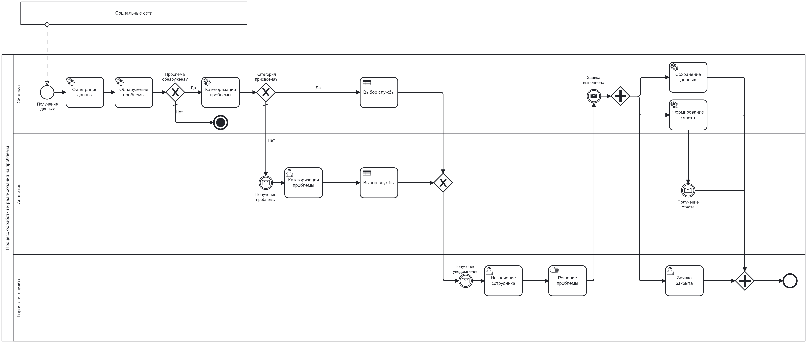
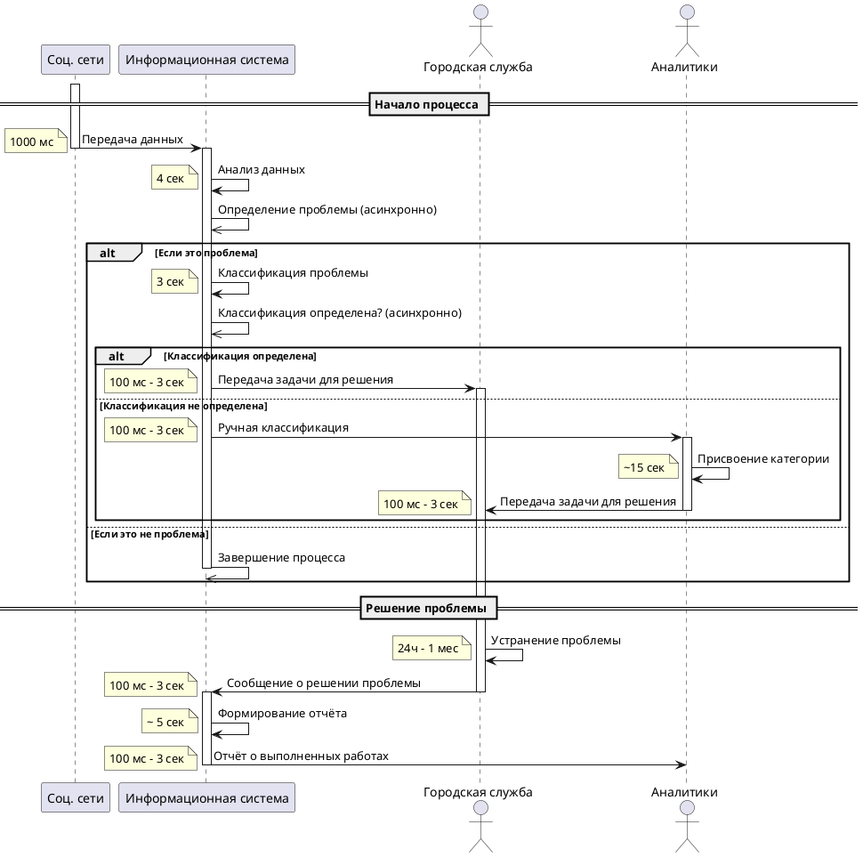

# Бизнес процесс

# Sequence diagram

```plantuml
@startuml
participant "Соц. сети" as SNS
participant "Информационная система" as IS
actor "Городская служба" as CS
actor "Аналитики" as Analysts

== Начало процесса ==
activate SNS
SNS -> IS: Передача данных
note left
1000 мс
end note
deactivate SNS
activate IS

IS -> IS: Анализ данных
note left
4 сек
end note
IS ->> IS: Определение проблемы (асинхронно) 

alt Если это проблема
    IS -> IS: Классификация проблемы
    note left
    3 сек
    end note
    IS ->> IS: Классификация определена? (асинхронно)

    alt Классификация определена
        IS -> CS: Передача задачи для решения
          note left
          100 мс - 3 сек
          end note
        activate CS
    else Классификация не определена
        IS -> Analysts: Ручная классификация
          note left
          100 мс - 3 сек
          end note
        activate Analysts
        
        Analysts -> Analysts: Присвоение категории
        note left
        ~15 сек
        end note
        Analysts -> CS: Передача задачи для решения
        note left
        100 мс - 3 сек
        end note
        deactivate Analysts
    end
else Если это не проблема
    IS ->> IS: Завершение процесса
    deactivate IS
end

== Решение проблемы ==
CS -> CS: Устранение проблемы
note left
24ч - 1 мес
end note
CS -> IS: Сообщение о решении проблемы
note left
100 мс - 3 сек
end note
deactivate CS
deactivate CS
activate IS
IS -> IS: Формирование отчёта
note left
~ 5 сек
end note
IS -> Analysts: Отчёт о выполненных работах
note left
100 мс - 3 сек
end note
deactivate IS
deactivate Analysts

@enduml
```

## Описание участников процесса
табличка с указанием участника и его описание

## Описание технологий, используемых при реализации данной интеграции